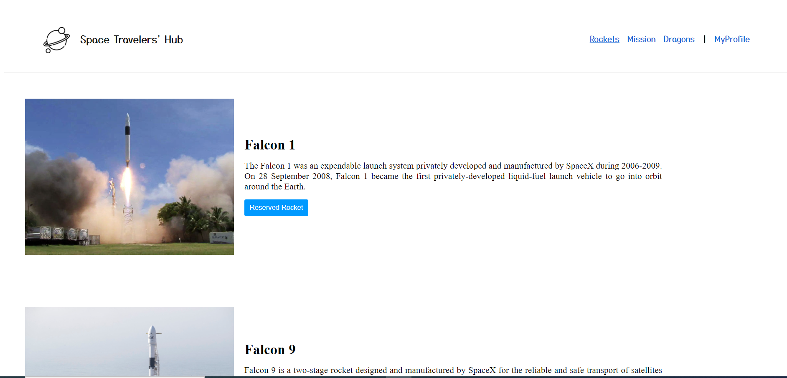
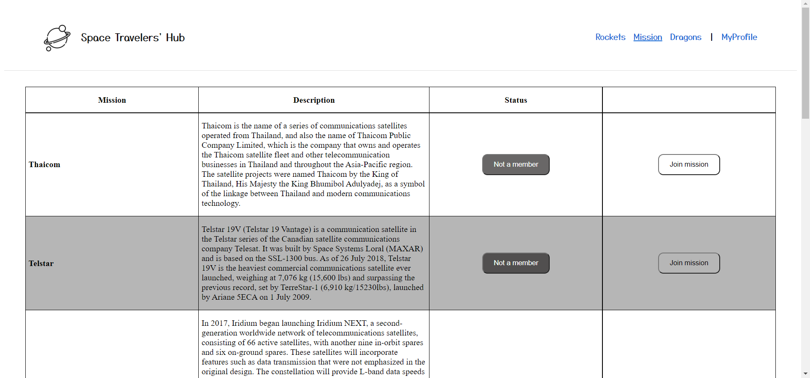
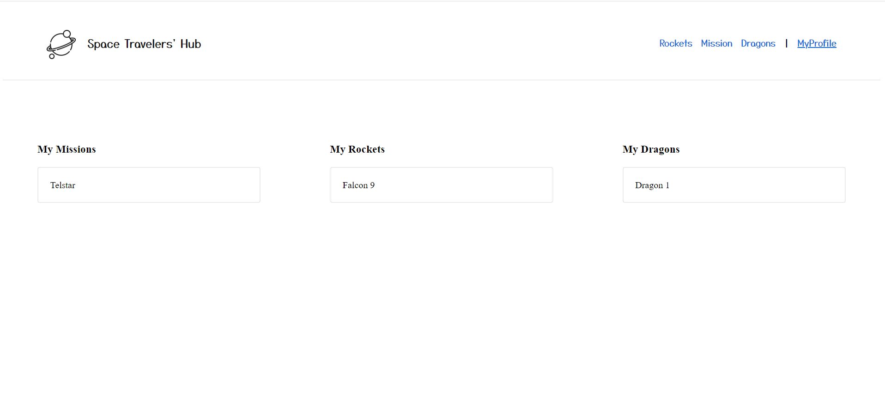

# Space-travellers




"Space-travellers " this is a four-page web app built with React.js and redux. The rockets page show about rockets info, the mission  page shows about mission, dragons page shows about dragon and profile page shows reserved task from three pages   


## Live Demo

- [Live link](https://sbf-spacetravellers.herokuapp.com/)
).

### Features implemented so far are:

- Project Setup with React Installations

## Built With

- React (A free and open-source front-end JavaScript library for building user interfaces based on UI components)
- Stylelint (A mighty, modern linter that helps you avoid errors and enforce conventions in your styles).
- ESlint (A mighty, modern linter that helps you avoid errors and enforce conventions in JavaScript codes)

To get a local copy up and running follow these simple example steps.

### Prerequisites

The basic requirements for building the executable are:

- A working browser application (Google chrome, Mozilla Fire fox, Microsoft edge ...)
- VSCode or any other equivalent code editor
- Node Package Manager (For installing packages like Lighthous, webhint & stylelint used for checking for debugging bad codes before deployment)

# Getting Started

#### Cloning the project

```
git clone  https://github.com/usorfaitheloho/space-travellers.git <Your-Build-Directory>
```

## Getting packages and dependencies

To get all package modules required to build the project run:

```
npm install
```

every package module required to build the project is listed in the package.json file. this is used as a reference to get all dependencies.

## Building

To build the project run:

```
npm run build
```

after you run this sucessfully you'd locate the build from in the `build` folder located from the parent directory of the project.

## Running

To run the program on a browser through a server run this command in your cli

```
npm start
```

This should open the page in your localhost on port 3000. then you'd be able to view the built page generated using webpack.

👤 **Authors**


- GitHub: [@Samiullah Bahadur](https://github.com/samiullahbahadur)
- GitHub: [@Bushra Mustofa](https://github.com/bushmusi)
- GitHub: [@faith Usor](https://github.com/usorfaitheloho)

## Show your support

Give a ⭐️ if you like this project!

## Acknowledgments

- Microverse
- My coding partners(@usorfaitheloho)

## 📝 License

This project is [MIT](./MIT.md) licensed.
